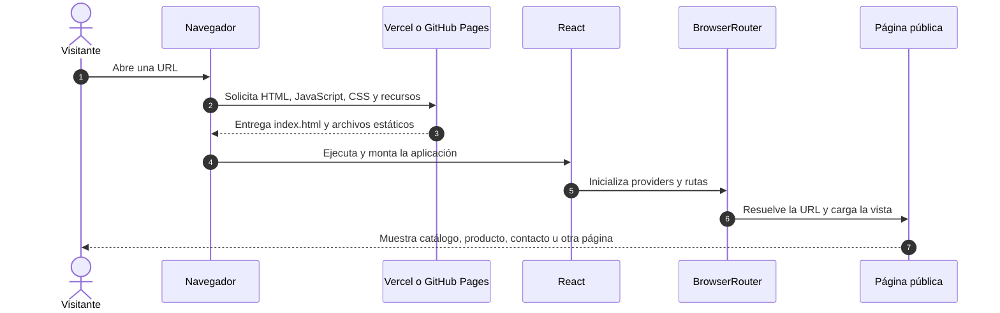
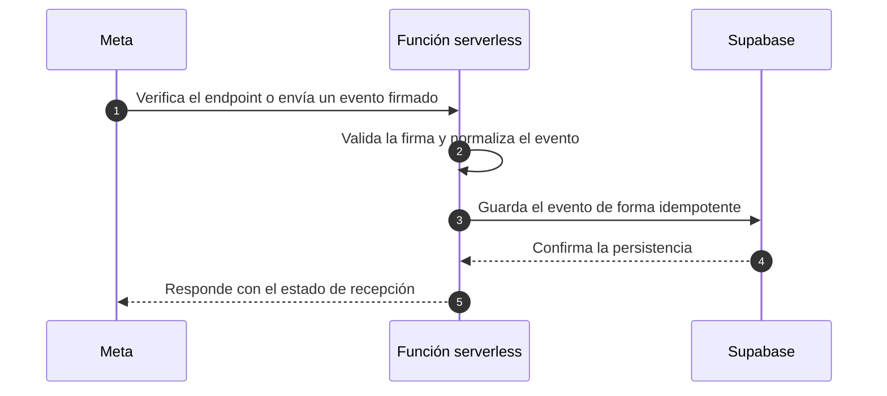

# Diagrama de secuencia — Webpd

## Navegación del sitio

```mermaid
sequenceDiagram
    autonumber
    actor Visitante as Visitante
    participant Navegador as Navegador
    participant Hosting as Vercel o GitHub Pages
    participant App as React
    participant Router as BrowserRouter
    participant Pagina as Página pública

    Visitante->>Navegador: Abre una URL
    Navegador->>Hosting: Solicita HTML, JavaScript, CSS y recursos
    Hosting-->>Navegador: Entrega index.html y archivos estáticos
    Navegador->>App: Ejecuta y monta la aplicación
    App->>Router: Inicializa providers y rutas
    Router->>Pagina: Resuelve la URL y carga la vista
    Pagina-->>Visitante: Muestra catálogo, producto, contacto u otra página
```

## Webhook de WhatsApp

```mermaid
sequenceDiagram
    autonumber
    participant Meta as Meta
    participant Webhook as Función serverless
    participant DB as Supabase

    Meta->>Webhook: Verifica el endpoint o envía un evento firmado
    Webhook->>Webhook: Valida la firma y normaliza el evento
    Webhook->>DB: Guarda el evento de forma idempotente
    DB-->>Webhook: Confirma la persistencia
    Webhook-->>Meta: Responde con el estado de recepción
```
